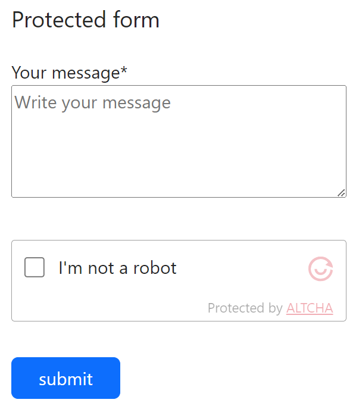
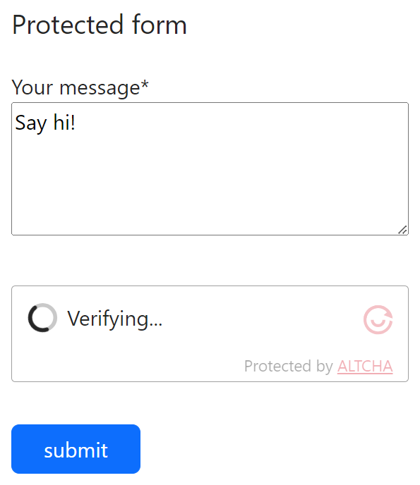
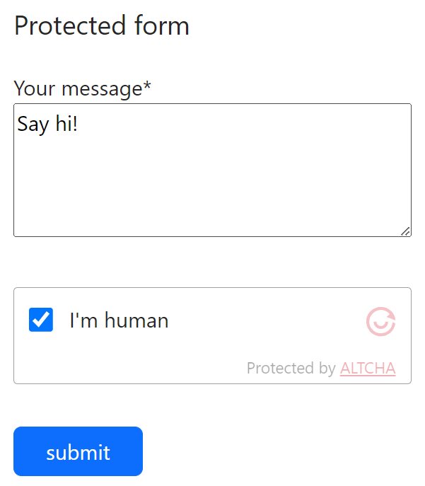

# Contao Altcha Antispam

This is a [**Contao CMS**](https://contao.org) implementation of [**Altcha**](https://altcha.org/). The extension provides a **front end** **form field** for the **Contao form generator**.

|  |  |  |
|-------------------------------------------------------------|-------------------------------------------------------------|-------------------------------------------------------------|

**ALTCHA** uses a proof-of-work (POW) mechanism to protect your forms from spam and abuse. Unlike other solutions, **ALTCHA** is **self-hosted**, does not use cookies nor fingerprinting, does not track users, and is **fully compliant** with **GDPR**.

[Visit https://altcha.org](https://altcha.org)

## Installation

You can install the package via composer:

```bash
composer require markocupic/contao-altcha-antispam
```

Afterwards run the database migration task:

```bash
php vendor/bin/contao-console contao:migrate
```

## Configuration and usage

**Important!** When installed, you have to set the `hmac_key` in your `config/config.yaml`.

Run composer install in your terminal to clear cache and install the dependencies if you made changes to the `config.yml` file.

```yaml
markocupic_contao_altcha_antispam:
  hmac_key: 'sdfsadZUI#!@sfdssf321231' # required
  algorithm: 'SHA-256' # optional
  range_min: 10000 # optional
  range_max: 100000 # optional
  challenge_expiry: 3600 # optional
```

| key                | default value | info                                                                                                                                                                                                                      | Required |
|--------------------|:--------------|---------------------------------------------------------------------------------------------------------------------------------------------------------------------------------------------------------------------------|:---------|
| `hmac_key`         | `''`          | Set a kind of a secret key/salt, e.g. `sdfsadZUI#!@sfdssf321231`                                                                                                                                                          | **yes**  |
| `algorithm`        | `SHA-256`     | Choose between `SHA-256`, `SHA-512` or `SHA-384`                                                                                                                                                                          | no       |
| `range_min`        | `10000`       | Choose a higher value to increase the complexity/duration. A minimum value of the random number of at least several thousand as a "minimum required complexity" is recomended. [More](https://altcha.org/docs/complexity) | no       |
| `range_max`        | `100000`      | Choose a higher value to increase the complexity/duration. The maximum value of 100,000 is a good start for most systems. [More](https://altcha.org/docs/complexity)                                                      | no       |
| `challenge_expiry` | `3600`        | Choose an expiration time, so that there is not an infinite amount of time to solve the challenge.                                                                                                                        | no       |

## Endpoint (route)

Out of the box, the extension will use the `/_contao_altcha_challenge` endpoint to get the challenges.
