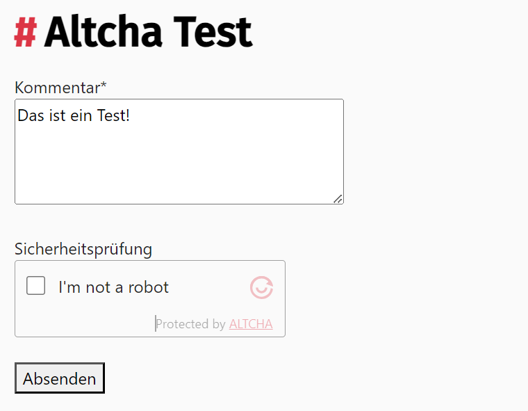

# Contao Altcha Antispam

This is a Contao implementation of [Altcha](https://altcha.org/). The extension provides a front end form field for the Contao form generator.



## Installation

You can install the package via composer:

```bash
composer require markocupic/contao-altcha-antispam
```

## Configuration and usage

**Important!** When installed, you must set the `hmac_key` in your `config/config.yaml`.

```yaml
markocupic_contao_altcha_antispam:
    hmac_key: 'sdfsadZUI#!@sfdssf321231' # required
    algorithm: 'SHA-256' # optional allowed: 'SHA-256', 'SHA-512' or 'SHA-384'
    range_min: 1000 # optional Adjust complexity here
    range_max: 100000 # optional
```

| key         | default value | info                                                                                                  | Required |
|-------------|:--------------|-------------------------------------------------------------------------------------------------------|:---------|
| `hmac_key`  | `''`          | a kind of a secret key                                                                                | **yes**  |
| `algorithm` | `SHA-256`     | Choose between `SHA-256`, `SHA-512` or `SHA-384`                                                      | no       |
| `range_min` | `1000`        | Choose a higher value to increase the complexity/duration. [More](https://altcha.org/docs/complexity) | no       |
| `range_max` | `100000`      | Choose a higher value to increase the complexity/duration. [More](https://altcha.org/docs/complexity) | no       |

## Endpoint (route)

Out of the box, the extension will use the `/_contao_altcha_challenge` endpoint to get the challenges.
